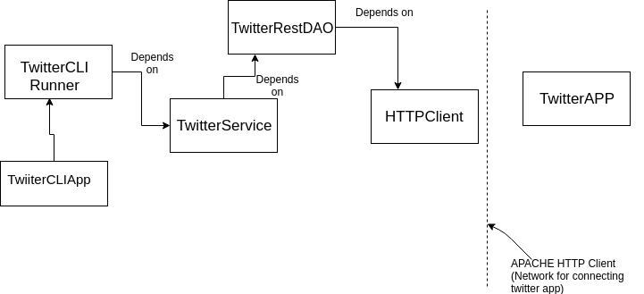

# Java_apps
Java_apps , contains three applications named:-
- TwitterCLIApp
- JavaGrep
- JDBC

# TWITTER CLI APP
   ## Introduction
Twitter CPI APP is designed to post, delete or search a tweet on Twitter from command line using Twitter RESTful API.

## Usage
 - **Posting a Tweet**
 ```
 post "tweet_text" ":latitude:longitude"
 ```       
 **Description**  These positional arguments when  passed  in the program is going  to create a tweet with geotag,and output the result in JSON fomat.for eg  `post "my first tweet" "40.730610:-73.935242"` will post tweet **my first tweet** with New York as its location.
 - **Deleting a Tweet** 
 ```
 delete "tweet_ids"
 ```
 **Description**  These positional arguments when passed  in the program is going  to delete a tweet with the given tweet_id .For eg. 
 `delete "90998"` will delete tweet with given tweet_id i.e 90998.
 - **Showing a Tweet**
 ```
 show "tweet_ids"
 ```
 **Description**  These positional arguments when passed  in the program is going  to look up for a  a tweet with the given tweet_id .For eg. `show "90998" "field_1, field_2..."` will show tweet with given tweet_id i.e 90998 and will show tweet with all foelds if third argument is empty otherwise, it will only specified fields.
 
## Design and Implementation
  The five components that we are building are:-
  
  Component   | Description
  ------------|---------
  |HttpHelper    | to handle HTTP request like GET, PUT, POST|
  |TwitterRestDao|Data Access Object which handles tweet object
  |TwitterService|Implements the business logic
  |CLIRunner     |Parse user CLI inputs and then calls the corresponding service methods.
  |main          |Create above components and start application 
  
  
 - TwitterCLIApp is entry point of the application where the main method resides.It contains all the dependencies and user input is passed to TwitterCLIRunner.
 - TwitterCLIRunner is responsible for parsing the input and depends on  the TwitterService
 - TwitterServiceImp  is the implementation of TwitterService interface and it is where we implements business logic an in this case it is that tweet_text cannot exceeds 140 characters and latitude and longitude should be btween min and max values defined and this contains another dependency i.e TwitterRestDAO, basically here we validate the tweet.

 - TwitterRestDAO is  implementation of CrdRepository and responsible for creating URIs to post,show and delete tweet .It depends on ApacheHTTPHelper .
 - ApacheHTTPHelper whih is implemetation of HTTPHelper interface. This class takes URIs and implemets get, post method accordingly and get the response from server.It also has authentication details. 
 
## Testing
  A unit test is a piece of code written by a developer that executes a specific functionality in the code to be 
  tested and asserts a certain behavior or state. Demonstarting ne of the method created for the `TwitterRestDao` for the create method
  ```
  public class TwitterRestDaoTest extends Object {
  
    private Tweet expectedTweet;
    private CrdDao dao;
    private String id;
  
    @Before
    public void setup() {
      System.out.println("Setup unit test");
      //setup a expectedTweet
      String tweetStr = "this is a test tweet" + System.currentTimeMillis();
      this.expectedTweet = new Tweet();
      expectedTweet.setText(tweetStr);
  
      //setup dao
      HttpHelper httpHelper = new ApacheHttpHelper();
      this.dao = new TwitterRestDao(httpHelper);
    }
  
    @After
    public void cleanup() {
      System.out.println("Deleting " + this.id);
      //remove tweet
      dao.deleteById(this.id);
    }
  
    @Test
    public void create() throws Exception {
      //prepare tweet text
      Coordinates coordinates = new Coordinates();
      coordinates.setCoordinates(Arrays.asList(50.0, 50.0));
      coordinates.setType("Point");
      expectedTweet.setCoordinates(coordinates);
      System.out.println(JsonUtil.toPrettyJson(expectedTweet));
  
      //call create method
      Tweet createTweet = (Tweet) dao.create(expectedTweet);
      System.out.println(JsonUtil.toPrettyJson(createTweet));
      //validate tweet object
      assertTweets(expectedTweet, createTweet);
      this.id = createTweet.getIdStr();
  
      Tweet showTweet = (Tweet) dao.findById(this.id);
      assertTweets(expectedTweet, showTweet);
    }
  
    public void assertTweets(Tweet expected, Tweet actual) {
      assertNotNull(actual);
      assertNotNull(actual.getIdStr());
      assertEquals(expected.getText(), actual.getText());
      assertEquals(expected.getCoordinates(), actual.getCoordinates());
    }
  }
  ```
  
  we have three annotations here
  - @Before:- Run before @Test, public void
  - @After – Run after @Test, public void
  - @Test – This is the test method to run, public void
  
 

 ## Enhancements
 When we have dependencies in our program then we can use Spring Framework 
 that is going to manage the relationship by itself and we dont have to worry about it  spring is going to manage 
 by itself.In order to use spring in our program , we need to add dependency in our system.
 ```
 
 <parent>
 <groupId>org.springframework.boot</groupId>
     <artifactId>spring-boot-starter-parent</artifactId>
    <version>2.1.3.RELEASE</version>
    <relativePath/>
 </parent>
 
 <dependency>
 <groupId>org.springframework.boot</groupId>
 <artifactId>spring-boot-starter-web</artifactId>
 </dependency>
 ```
 
 Now, we are going to  put annotation `@service` for classes and `@Autowired` above the dependencies.
 now we are going to make another package named `spring` under that we are going to implement Java beans i.e first approach for this.
 TwitterRestDao,TwitterServiceImp,TwitterCLIRunner are allJavaBeans. Generally speaking,JavaBeans are java objects that are managed by IoC. (Not all objects are beans)
 We have implemeneted javaBean approach in  `TwitterCLIBean`  and another approach component scan in other class named `TwitterCLIComponentScan`
 TwitterCLIComponent looks like this
 ```
  public static void main(String[] args) {
     ApplicationContext context = new AnnotationConfigApplicationContext(
         TwitterCLIComponentScan.class);
     TwitterCLIRunner runner = context.getBean(TwitterCLIRunner.class);
     runner.run(args);
   }
 ```


# Java Grep App
   ## Introduction

 
The app searches for a text pattern recursively in a given directory, and output matched lines to a file. 
The app takes three arguments:
- Regex - a special text string for describing a search pattern
- rootPath - root directory path
- outFile - output file name


It searches all files in ` ~/dev/jrvs/bootcamp/linux_sql directory`, and output lines contain data
keyword to the output file `/tmp/grep.out`


 
 ## Usage
 In order to understand better lets take use case. for instance , we want to search for a word for eg. data in the your directory named `linux_sql` and then you output those lines that contains 
  `data`in it and we gonna name the file as grep.out. In this we are going to give exact root path to the files or directories. so the positional arguments
  that are going to pass in this example will be and these all three arguments are of `String` type.
  
 

 ```
 .*data.* ~/dev/jrvs/bootcamp/linux_sql /tmp/grep.out
 ```

- regex:- The first argument `.*data.*` that we are going to pass in the function is nothing 
but a sequence of characters that define te search pattern.

- rootPath:- The second argument the root path to the directory from which we want to search from.
In this case it is `~/dev/jrvs/bootcamp/linux_sql`.
- outFile:- The argument is the root path to the output file where we want to sae the lines that contains
  word `data ` in it, which is `/tmp/grep.out` in this case.
  
 
 ## Design and Implementation
    
- Pseudo code: Sample pseudo for this app is gonna be like 
```
matchedLines = []
for file in listFiles(rootDir)
    for line in readLines(file)
        if containsPattern(line)        
         matchedLines.add(line)
writeToFile(matchedLines) 
```
- Workflow: When we run our program it is going to grab those arguments first and gonna initialise them in the program.Then it is going in 
rootDir file and it gonna go through each and every file in that directory and even in the files in this sub-directories.
Then for every line in the file its going to match  the `regex pattern` in this case its data with every line
 in the files. For every line that contains that pattern is going to be added in the list `matchedLines`.The matchedLines
 are gonna written in the outFile `grep.out` in this case.
    
- Libraries:- The Libraries that we used for this app are:
    - Java.io.File
    - Java.io.BufferedReader:
    - Java.io.OutputStreamWriter
    - java.io.FileOutputStream 
    - java.nio.charset.StandardCharsets
    - java.util.List
    - java.nio.file.Path
  

  
## Enhancements and Issues:- 
Java 8 comes with a pretty handy tool  that is "Lambda Expression " .Lambda expressions basically express
 instances of functional interfaces (An interface with single abstract method is called functional interface. An example is java.lang.Runnable). lambda 
expressions implement the only abstract function and therefore
 implement functional interfaces So we can we make use of lambda in '
in our methods in order to reduce the number of lines. for example our `readLines` method looks something
like this
```
public List<String> readLines(File inputFile) {
    if (!inputFile.isFile()) {
      throw new IllegalArgumentException("Not a file");
    }
    List<String> lines = new ArrayList<>();
    BufferedReader br;
    try {
      br = new BufferedReader(new FileReader(inputFile));
      String line;
      while ((line = br.readLine()) != null) {
        lines.add(line);
      }
    } catch (IOException e) {
      e.printStackTrace();
    }
    return lines;
  }

``` 
 
  But with the use of lambda we can reduce this into one-two lines code like this:
  ```
  public List<String> readLines(File inputFile) throws IOException {
      return Files.lines(Paths.get(inputFile.getPath())).collect(Collectors.toList());
    }
  
  ```
  The issue with using lambda expresiions is that they are hard to debug and have longer call stack

## Maven

Maven is a build automation tool used primarily for Java projects.Maven addresses two aspects of building software: first, it 
describes how software is built, and second, it describes its dependencies.So we
 can we our project as java_apps as Maven project. All you need to know is on your IntelliJ
 go on your terminal and type the following code.
 ```
 
 
 mkdir-p src/main/java src/main/resources
 tree ./src
 #move if neccessary
 mv src/ca src/main/java/
 touch pom.xml
 
 ```
 
 pom.xml content
 
 ```
 <project xmlns="http://maven.apache.org/POM/4.0.0"xmlns:xsi="http://www.w3.org/2001/XMLSchema-instance"xsi:schemaLocation="http://maven.apache.org/POM/4.0.0 http://maven.apache.org/xsd/maven-4.0.0.xsd">
 <modelVersion>4.0.0</modelVersion>
 <groupId>ca.jrvs.apps</groupId>
 <artifactId>java_apps</artifactId>
 <version>1.0-SNAPSHOT</version>
 <properties>
 <maven.compiler.source>1.8</maven.compiler.source>
 <maven.compiler.target>1.8</maven.compiler.target>
 </properties>
 <dependencies>
    <dependency>
    <groupId>junit</groupId>
    <artifactId>junit</artifactId
    ><version>4.12</version>
    <scope>test</scope>
    </dependency>
 </dependencies>
 </project>
 
 
 ```
 Go on terminal and type this command 
 
 `rm -rf java_apps.iml .idea/`
 
 - close IDE window and delete java_apps project
 - `Import Project`> `Maven` > check `Import Maven Projects automatically`> `next` > `jdk 1.8` > `Finish` 
 - Run `ca.jrvs.apps.grep.JavaGrepImp` to verify project imported ok 
 `mvn clean package`
 Run `tree ~/.m2/repository/`
 
 
 # Java DataBase Connectivity(JDBC)
   ## Introduction
JDBC is an acronym for Java Database Connectivity. 
It’s an advancement for ODBC ( Open Database Connectivity ). 
JDBC is an standard API specification developed in order to move data from 
frontend to backend. This API consists of classes and interfaces written in Java.
 It basically acts as an interface (not the one we use in Java) or channel 
 between your Java program and databases i.e it establishes a link between the
  two so that a programmer could send data from Java code and store it in the 
  database for future use.
  
## Basic Flow
 The below diagram describes the basic workflow of the JDBC :
 
 
 So first you application will mount the driver and then using the drive it will create a connection
 .From connections , we can execute the SQL statements whether they are queries or or actual statements by themselves.
 Then, we can either commit those changes if they were any or roll them back and then we can close the connection.
 Each and every operation in JDBC throws and SQL Exception which is used to know what cause an error
 
## Postgres
 PostgreSQL or "Postgres", is an object-relational database management 
 system(ORDBMS) with an emphasis on extensibility and standards-compliance.
  As a database server, its primary function is to store data securely, 
  supporting best practices, and to allow for retrieval at the request 
  of other software applications.For this app , we have created 5 tables in a database 
 The structure of the queries are given in the `jdbc_sql`  file and documentation of installing postgres through docker is 
 given in the `readme.md.`
##Creating the project
 First, We need to add JDBC driver, made changes in your pom.xml file 
 
 ```
 <dependency>
 <groupId>org.postgresql</groupId>
 <artifactId>postgresql</artifactId>
 <version>42.2.5</version>
 </dependency>
 ```
 Now, we are hoing to craete a java class named.
 `JDBC Executer` that is going to be main entry point of this app so taht we can run all pur functions.
 In order to create a connection with the database we need to craete a java class named`DatabaseConnectionManager
 We are going create a constructor that is going to take four arguments in order to mestablih an connection with
 the database. The sample code for  the constructor is:-
 ```
 public DatabaseConnectionManager(String host, String databaseName, String username,
       String password) {
     this.url = "jdbc:postgresql://" + host + "/" + databaseName;
     this.properties = new Properties();
     this.properties.setProperty("user", username);
     this.properties.setProperty("password", password);
   }
 ```
 
 Then we ae going to create an nterface named `DataTransferObject` to hold properties and getters and setters.
 Create   another class named `DataAccessObject(DAO)`  where we are going to define our
 CRUD  i.e Create, Read, Update and Delete operations.
 Consider an  example, for a query that needs data from all four tables nad output them in a 
 result set.
 ```
 SELECT  c.first_name, c.last_name, c.email,
 o.order_id,  o.creation_date, o.total_due, 
 o.status,  s.first_name, s.last_name, s.email,
 ol.quantity,  p.code, p.name, p.size, p.variety,
 p.price
 from orders o 
 join customer c on o.customer_id = c.customer_id
 join salesperson s ono.salesperson_id=s.salesperson_id 
 join order_item ol on ol.order_id=o.order_id 
 join product p on ol.product_id = p.product_id
 where o.order_id = ?;
 ```
 Then now for this we need Customer DAO and Orders DAO and both are going to extends DataAccessObject Class .
 we are going to CRUD operations in the both. We are going to create DTO for  Customer,Order and OrderLine which are going to implement `DataTransferObject ` class.
 Customer class will look like this.
 ```
 package ca.jrvs.apps.jdbc;
 
 import ca.jrvs.apps.jdbc.util.DataTransferObject;
 
 public class Customer implements DataTransferObject {
 
   private long id;
   private String firstName;
   private String lastName;
   private String email;
   private String phone;
   private String address;
   private String city;
   private String state;
   private String zipCode;
 
   public long getId() {
     return id;
   }
 
   public void setId(long id) {
     this.id = id;
   }
 
   public String getFirstName() {
     return firstName;
   }
 
   public void setFirstName(String firstName) {
     this.firstName = firstName;
   }
 
   public String getLastName() {
     return lastName;
   }
 
   public void setLastName(String lastName) {
     this.lastName = lastName;
   }
 
   public String getEmail() {
     return email;
   }
 
   public void setEmail(String email) {
     this.email = email;
   }
 
   public String getPhone() {
     return phone;
   }
 
   public void setPhone(String phone) {
     this.phone = phone;
   }
 
   public String getAddress() {
     return address;
   }
 
   public void setAddress(String address) {
     this.address = address;
   }
 
   public String getCity() {
     return city;
   }
 
   public void setCity(String city) {
     this.city = city;
   }
 
   public String getState() {
     return state;
   }
 
   public void setState(String state) {
     this.state = state;
   }
 
   public String getZipCode() {
     return zipCode;
   }
 
   public void setZipCode(String zipCode) {
     this.zipCode = zipCode;
   }
 
   @Override
   public String toString() {
     return "Customer{" +
         "id=" + id +
         ", firstName='" + firstName + '\'' +
         ", lastName='" + lastName + '\'' +
         ", email='" + email + '\'' +
         ", phone='" + phone + '\'' +
         ", address='" + address + '\'' +
         ", city='" + city + '\'' +
         ", state='" + state + '\'' +
         ", zipCode='" + zipCode + '\'' +
         '}';
   }
 }
 ```
 
 We are going to include every field that is in customer table and gonna generate getters and setters for them
 we are gonna implement the code the result we are going to get is:
 ```
 {"id" : 1000,
 "customerFirstName" : "Angela",
 "customerLastName" : "Crawford",
 "customerEmail" : "acrawford8p@com.com",
 "creationDate" : 1463198400000,
 "totalDue" : 118.22,
 "status" : "paid",
 "salespersonFirstName" : "Edward",
 "salespersonLastName" : "Kelley",
 "salespersonEmail" : "ekelleyu@hplussport.com",
 "orderLines" : [ {
      "quanitity" : 31,
      "productCode" : "MWCRA20",
      "productName" : "Mineral Water",
      "productVariety" : "Cranberry",
      "productPrice" : 1.79  }, 
      {
      "quanitity" : 17,
      "productCode" : "MWLEM32",
      "productName" : "Mineral Water",
      "produceSize" : 32,
      "productVariety" : "Lemon-Lime",
      "productPrice" : 3.69 
       } ]
      }
 ```
## Enhancements:- 
 We can  make following enhancements to the systems:- 
 - Classification of SQLException into transient and non-transient types.
 - Support for chained exceptions.
 
 
